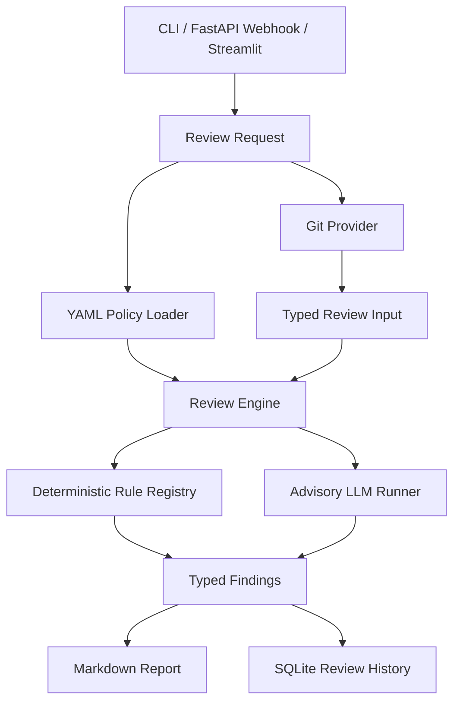

# Architecture

MR Guardian is organized around one review pipeline shared by the CLI, GitLab
webhook service, and Streamlit dashboard.


## Design Goals

- Keep interfaces thin: CLI, FastAPI, and Streamlit call core services instead
  of owning business logic.
- Keep YAML as the runtime source of truth for all executable rules.
- Use deterministic rules for reliable enforcement and LLM rules for advisory
  review judgment.
- Evaluate each MR in two dimensions: coding quality and MR structure/readiness.
- Preserve traceability through stable rule IDs in policy files, findings,
  reports, and stored history.
- Isolate provider failures so local review still completes when optional AI or
  GitLab capabilities are unavailable.

## Runtime Flow



## Core Components

| Component | Responsibility |
|---|---|
| `mr_guardian.cli` | Typer command wiring only. |
| `mr_guardian.core` | Review orchestration, GitLab workflows, metadata handling, and shared engine calls. |
| `mr_guardian.providers` | Local Git collection, GitLab repository sync, and GitLab API comment delivery. |
| `mr_guardian.policies` | YAML loading, validation, packaged policy fallback, and policy path resolution. |
| `mr_guardian.rules` | Deterministic rule implementations and registry. |
| `mr_guardian.summarizer_ai` | Advisory LLM rule execution, prompting, structured output parsing, and provider error handling. |
| `mr_guardian.reporting` | Markdown report rendering and review-history output. |
| `mr_guardian.storage` | SQLite schema, review persistence, triggered-rule queries, and LLM metric storage. |
| `app` | FastAPI webhook entrypoint and Streamlit dashboard entrypoint. |

## Policy Model

Runtime policies are YAML files with only two top-level fields:

```yaml
version: 1
rules: []
```

Every rule declares:

- `id`
- `type`
- `evaluation`
- `enabled`
- `severity`
- `source`
- `description`

Deterministic rules also declare `implementation`. LLM rules declare `prompt`.
Rule-specific configuration lives under `parameters`.

The supported evaluation dimensions are:

- `coding`: implementation quality, runtime risk, maintainability, Unity/C#/Python
  correctness, and asset/code-level concerns.
- `mr_structure`: review readiness, MR metadata, validation evidence, size,
  scope, and whether the MR is framed clearly enough for human review.

Pydantic models reject unknown rule-level fields and invalid combinations, such
as LLM rules with `severity: blocking`.

## Evaluation Summaries

MR Guardian keeps individual findings as rule-level evidence, then aggregates
them into MR-level evaluation summaries:

```text
Overall risk
Coding risk
MR structure risk
```

Each summary stores the dimension, risk, severity counts, and triggered rule
IDs for that dimension. Reports show this near the top so reviewers can tell
whether the main problem is implementation quality, MR readiness, or both.

## Deterministic Rules

Deterministic rules inspect typed review input from Git diffs. They cover checks
such as:

- MR metadata sections.
- changed file and line thresholds.
- Unity scene, prefab, ProjectSettings, and validation requirements.
- C# debug logs, `GetComponent`, public fields, class size, method size, and
  method parameter counts.
- Unity event lifecycle, per-frame allocation, pooling, and `Resources.Load`
  patterns.

Each deterministic rule has focused tests and is registered through the rule
registry.

## LLM Rules

LLM rules are configured in YAML and evaluated only when an LLM provider is
enabled. The runner injects selected review context, asks for structured JSON,
validates the response, and normalizes findings.

Important boundaries:

- LLM rules are advisory.
- LLM rules cannot be configured as blocking.
- LLM rules inherit the YAML rule's evaluation dimension unless validated model
  output supplies a supported dimension.
- Returned blocking findings are defensively downgraded.
- Missing dependencies, rate limits, malformed responses, and provider failures
  become advisory `info` findings.
- Per-rule duration and token usage are captured when the provider reports them.

This keeps deterministic review reliable while still allowing judgment-heavy
Unity review prompts.

## Persistence and Reporting

Review results are rendered as Markdown and can be stored in SQLite. Stored
records include:

- review scope, branch, MR ID, and developer identity
- coding and MR-structure evaluation summaries
- risk and severity counts
- changed file and line counts
- triggered rule IDs
- generated report
- LLM provider, model, status, duration, token usage, and error details

The Streamlit dashboard reads the same store to show recent reviews, risk
trends, and most triggered rules.

## Packaging

Source checkouts use repo-local policies from `sources/yaml`. Installed wheels
include packaged default policies under `mr_guardian/defaults/yaml`; the policy
resolver falls back to those defaults when the repo-local directory is missing
or empty.
