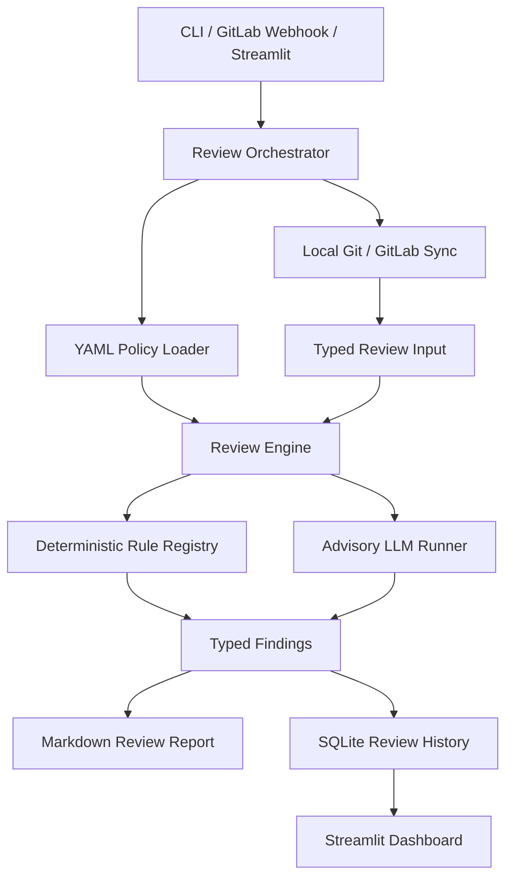

# MR Guardian

**Human-centered pre-review automation for merge requests.**

AI-assisted development helps teams ship faster, but it also makes changes harder to track.

MR Guardian turns your team’s standards into early MR checks. Deterministic rules catch clear risks before review, like oversized MRs or protected files being modified, while customizable LLM rules help cover issues that need more context.

Reviewers will spend less time on routine checks and more time on decisions that need human judgment.

> **See it in action:** [Link]

**LLM analysis requires an API key.**

## Why MR Guardian exists

AI-assisted development has made writing code easier, but verifying it harder: merge requests are larger, generated code can look correct without being safe, and specialized workflows often hide risk outside normal diffs.

MR Guardian
- junior developers get earlier feedback;
- senior engineers spend less time on mechanical checks;
- teams build shared memory around recurring risks;
- AI stays bounded, transparent, and advisory;
- final judgment stays with the people responsible for the system.

The goal is not fewer human reviews.

The goal is better human reviews: calmer, clearer, more focused, and more respectful of everyone’s time.

## How rules are made

Deterministic rules handle clear production signals, while scoped LLM checks add structured, non-blocking analysis where context helps.

## What MR Guardian does

MR Guardian reviews local Git diffs or GitLab Merge Requests and produces a structured Markdown report. When used through GitLab webhooks, it can run automatically on MR events and optionally post findings back to the merge request.

It focuses on three questions:

1. **Is this merge request reviewable?**  
   Does it include enough description, validation evidence, and scope control for a human reviewer to make a good decision?

2. **Does it touch production-sensitive Unity areas?**  
   Does it modify scenes, prefabs, serialized assets, `ProjectSettings`, packages, plugins, gameplay scripts, runtime loading, lifecycle behavior, physics, UI, or ScriptableObject patterns?

3. **Are there repeatable code risks that should be checked before review?**  
   Does the change contain patterns such as debug logs, large classes or methods, broad directory scope, per-frame allocations, `GetComponent` usage, event subscription issues, pooling concerns, or `Resources.Load` usage?

## Why it is useful in production workflows

MR Guardian is useful because it adds a **pre-review quality gate** where teams usually rely on human attention alone.

| Production review problem | How MR Guardian helps |
| --- | --- |
| Reviewers are overloaded by more frequent or larger MRs | Summarizes risk before review and highlights scope, changed files, and triggered rules. |
| AI-assisted code increases the need for verification | Treats LLM output as advisory and keeps deterministic policy checks as the reliable base. |
| Unity risk is not always obvious from text diffs | Flags Unity-specific change areas such as scenes, prefabs, settings, packages, plugins, and gameplay behavior. |
| Teams repeat the same review comments across MRs | Encodes recurring review expectations as YAML policy with stable rule IDs. |
| Senior engineers spend time on mechanical checks | Automates repeatable checks so humans can focus on architecture, correctness, product impact, mentorship, and tradeoffs. |
| Review feedback is hard to measure over time | Stores review history, triggered rules, risk counts, changed lines/files, reports, and LLM metrics in SQLite. |
| AI reviewers can be noisy or overconfident | Uses bounded LLM rules with structured output, max-finding limits, retries, timeouts, token metrics, and failure isolation. |

## Design principle: automation should reduce risk, not create new risk

MR Guardian deliberately avoids a “just ask an LLM to review the diff” architecture.

Instead, it separates review into two layers:

- **Deterministic rules** produce reliable findings for enforceable policies.
- **LLM rules** provide bounded advisory review for judgment-heavy areas where language models can help but should not block a merge.

This keeps the system explainable. A production team can inspect the policy, trace findings to stable rule IDs, understand which checks are deterministic, and decide how much trust to place in advisory AI output.

## What this demonstrates

- Agentic AI workflow design across policy loading, tool-backed diff collection, rule routing, LLM execution, reporting, and persistence.
- A deterministic-first review architecture that uses AI without surrendering correctness to the model.
- Policy-as-code using executable YAML rules, stable rule IDs, typed validation, and package-ready default policies.
- Tool-augmented reasoning over MR metadata, changed files, diff hunks, GitLab webhook events, repository state, and review history.
- Unity-specific engineering judgment for scenes, prefabs, `ProjectSettings`, gameplay scripts, validation evidence, runtime loading, lifecycle, physics, UI, and ScriptableObject risk.
- Production-oriented reliability patterns: structured outputs, fallback behavior, rate-limit handling, non-fatal provider failures, tests, packaging, persisted metrics, and optional MR comments.

## Architecture at a glance

Runtime rules come only from YAML. Each rule declares `type: deterministic` or `type: llm`; deterministic rules map to Python implementations, while LLM rules carry prompts and output contracts. Markdown best-practice documents are kept as human guidance and are not loaded by runtime code.

## Core capabilities

- **Local and GitLab MR review**: review local diffs or GitLab Merge Requests before they reach human reviewers.
- **Webhook automation**: FastAPI GitLab webhook support accepts MR events, validates secrets, queues background reviews, syncs branches, stores results, and can post comments back to GitLab.
- **Deterministic rule engine**: enforce repeatable policy checks without relying on model behavior.
- **Advisory LLM review**: run scoped OpenAI-backed rules with structured JSON output and bounded finding counts.
- **YAML policy loading**: define review behavior through executable policy files instead of hard-coded review preferences.
- **Markdown reports**: generate readable review reports that separate deterministic findings from advisory AI feedback.
- **SQLite review memory**: persist review scope, developer identity, risk counts, changed files/lines, triggered rules, reports, and LLM metrics.
- **Streamlit analytics**: inspect review history, risk trends, and rule activity over time.
- **Packaging support**: ship default policies with wheel packaging and deployment notes.

## Technical highlights

- **Deterministic-first review model**: deterministic rules handle enforceable checks; LLM rules remain advisory and cannot create blocking findings.
- **Traceable policy architecture**: findings carry stable IDs such as `MR-META-001`, `UNITY-SCENE-001`, `CSHARP-DEBUG-001`, and `UNITY-PHYSICS-LLM-001`.
- **Typed policy validation**: Pydantic models reject invalid severities, missing implementations, blocking LLM rules, and unknown rule-level fields.
- **Bounded LLM execution**: OpenAI-backed rules use structured JSON output, prompt-scoped diff context, max-finding limits, retries, timeouts, rate-limit handling, and token usage capture.
- **Unity-aware rule coverage**: implemented rules cover MR metadata, changed size, broad directory scope, scenes, prefabs, `ProjectSettings`, gameplay validation, C# debug logs, `GetComponent`, class/method size, public fields, event subscriptions, per-frame allocations, pooling, and `Resources.Load`.
- **Review memory and analytics**: SQLite stores review scope, developer identity, risk counts, changed lines/files, triggered rules, generated reports, and per-rule LLM metrics for Streamlit analysis.
- **Automation-ready delivery**: webhook review, optional MR comments, Docker notes, deployment guidance, and package-ready defaults.

## Example review philosophy

MR Guardian is intentionally conservative:

- It should surface risks, not create noise.
- It should make human review easier, not bypass it.
- It should fail safely when an external provider fails.
- It should clearly distinguish enforceable policy from advisory model judgment.
- It should help teams learn which risks repeat across merge requests.

## Documentation

- Architecture: [`Docs/architecture.md`](Docs/architecture.md)
- Agent-assisted setup: [`Docs/agent-setup-prompt.md`](Docs/agent-setup-prompt.md)
- Installation: [`Docs/installation.md`](Docs/installation.md)
- LLM rule authoring: [`Docs/llm-rule-authoring.md`](Docs/llm-rule-authoring.md)
- Docker and Render notes: [`Docs/docker-deployment.md`](Docs/docker-deployment.md)
- Packaging notes: [`Docs/packaging.md`](Docs/packaging.md)
- Unity rule roadmap: [`Docs/unity-rule-roadmap.md`](Docs/unity-rule-roadmap.md)

## Roadmap

Implemented features include local review, all-policy YAML loading, deterministic Unity/C#/MR rules, advisory OpenAI-backed LLM rules, GitLab webhooks, GitLab MR comments, SQLite history, Streamlit analytics, report noise control, and wheel packaging.

Planned improvements:

- Add evaluation benchmarks for deterministic and LLM rule quality.
- Add tracing for per-rule execution, prompt payload size, and provider latency.
- Expand Unity coverage for serialized assets, Addressables, package changes, and editor/runtime migration risk.
- Add richer GitLab API support for MR metadata and repository state beyond local branch sync.
- Harden deployment with migrations, auth boundaries, CI packaging checks, and release automation.

## Positioning

MR Guardian is not a replacement for senior code review, team ownership, or engineering responsibility. It is a workflow layer for teams that want to preserve the human parts of review while code volume, AI-assisted development, and production pressure increase.

It helps reviewers stay focused on the work only humans can do well: understanding intent, challenging assumptions, mentoring teammates, protecting quality, and making careful decisions before code reaches production.

It helps reviewers answer the question that matters most:

**“What should I pay attention to before this change reaches production?”**
